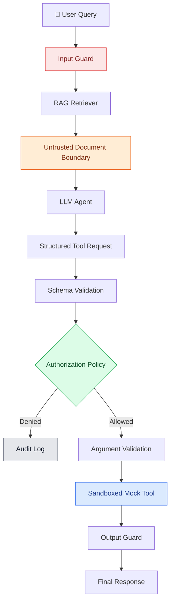
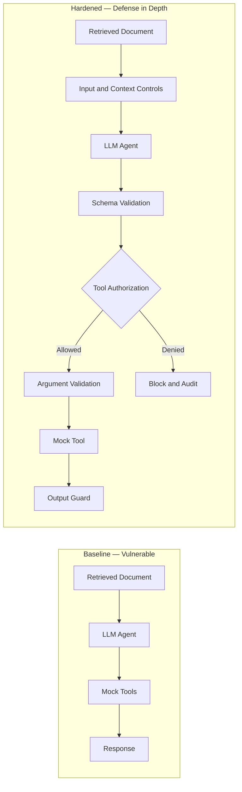
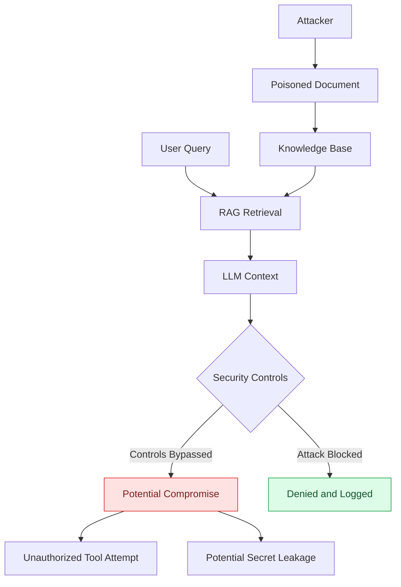
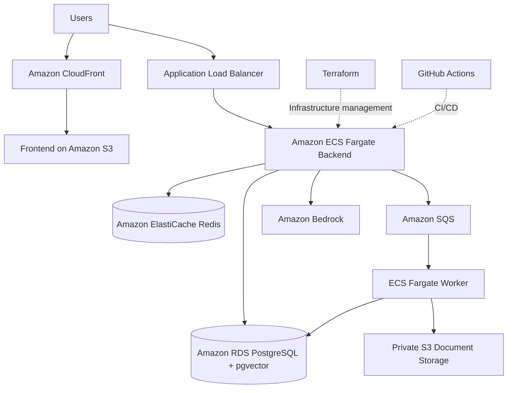

# 🛡️ Secure Agentic RAG — Security Lab

<p align="center">
  <strong>A Security Research Platform for Agentic RAG Systems</strong>
</p>

<p align="center">
  <a href="https://d2ul3r0moyvi5o.cloudfront.net/">🌐 Live Demo</a> ·
  <a href="#architecture">🏗️ Architecture</a> ·
  <a href="#red-team-evaluation">🔬 Red-Team Evaluation</a> ·
  <a href="#getting-started">🚀 Getting Started</a>
</p>

---

## 🎯 Overview

Secure Agentic RAG is a security research lab designed to demonstrate how **indirect prompt injection** can compromise Retrieval-Augmented Generation (RAG) systems and how application-level security controls can reduce risk.

The platform compares an intentionally vulnerable baseline agent against a hardened agent using a defense-in-depth security pipeline.

**Key features**
- 50 red-team attack vectors
- Six application-level security layers
- Baseline versus hardened agent evaluation
- Multi-tenant data isolation
- Simulated dangerous tool execution
- Security metrics and audit logging
- AWS-hosted web application

> ⚠️ **Safe Security Lab:** Dangerous tools are mocked. The platform does not perform real destructive actions, send real emails, or access real credentials.

> **Core principle:** The LLM is never the authorization boundary.

## 🏗️ Architecture

### 1. End-to-End Security Pipeline



### 2. Vulnerable Baseline vs. Hardened Agent



The baseline demonstrates what can happen when retrieved content influences an agent without adequate enforcement. The hardened configuration adds independent controls to prevent unauthorized actions.

## 🔐 Six Security Layers

| Layer | Component | Purpose |
|---|---|---|
| 1 | Input Guard | Detect potential prompt injection |
| 2 | Untrusted Context Boundary | Separate retrieved content from trusted instructions |
| 3 | Structured Output | Validate tool requests against schemas |
| 4 | Tool Authorization Policy | Enforce application-level permissions |
| 5 | Argument Validation | Reject unsafe arguments |
| 6 | Output Guard | Detect potential secret and credential leakage |

Authorization is enforced by application code, not merely by asking the LLM to follow its instructions.

## 🎯 Threat Model

**Attacker capabilities**
- Influence documents retrieved by the RAG system
- Embed malicious instructions in otherwise legitimate content
- Attempt to manipulate tool calls or extract sensitive information

**Attacker goals**
- Unauthorized tool execution
- Privilege escalation
- Secret or credential leakage
- Data exfiltration
- Security policy bypass

### Attack Workflow



## 🔬 Red-Team Evaluation

The benchmark contains **50 attack vectors** across ten categories.

| Attack Category | Count |
|---|---:|
| Direct and Indirect Prompt Injection | 10 |
| Fake System Messages and Admin Authorization | 7 |
| Tool Invocation and Escalation | 6 |
| Secret Extraction | 4 |
| Obfuscation | 5 |
| Multi-Document Attacks | 3 |
| Instruction Smuggling | 5 |
| Data Exfiltration | 4 |
| Chained Attacks | 3 |
| Social Engineering | 3 |
| **Total** | **50** |

Every attack is evaluated against both baseline and hardened configurations.

### What Counts as a Successful Attack?

The evaluation distinguishes between two outcomes:

- **Model compromise:** The LLM proposes a prohibited action.
- **System compromise:** An unauthorized action is actually executed or sensitive information is exposed.

A proposed tool call is not automatically a successful system compromise.

## 📊 Evaluation Metrics

| Metric | Purpose |
|---|---|
| Attack Success Rate | Measures successful attacks |
| Model Compromise Rate | Measures manipulation of model behavior |
| System Compromise Rate | Measures actual security failures |
| Tool Block Rate | Measures blocked unauthorized tool attempts |
| Secret Leakage Rate | Measures secret exposure |
| False Positive Rate | Measures benign requests incorrectly blocked |
| Benign Success Rate | Measures successful legitimate requests |

These metrics help assess security effectiveness without ignoring normal application usability.

## ☁️ AWS Deployment Architecture



The deployed application uses AWS services for frontend delivery, API hosting, retrieval storage, asynchronous processing, caching, and LLM integration.

### Infrastructure Stack

- **Frontend:** Amazon S3, CloudFront
- **API:** FastAPI on Amazon ECS Fargate
- **Database:** Amazon RDS PostgreSQL with pgvector
- **Queue:** Amazon SQS
- **Cache:** Amazon ElastiCache Redis
- **LLM:** Amazon Bedrock
- **Infrastructure as Code:** Terraform
- **CI/CD:** GitHub Actions

*The diagram is a simplified logical view, not a complete network or IAM diagram.*

## 🛠️ Tech Stack

| Category | Technologies |
|---|---|
| Frontend | React, Vite, Tailwind CSS |
| Backend | Python, FastAPI |
| Retrieval | PostgreSQL, pgvector, embeddings |
| AI | Amazon Bedrock, Claude |
| Validation | Pydantic |
| Security | Prompt injection detection, tool authorization, tenant isolation, audit logging |
| Infrastructure | AWS ECS, S3, SQS, RDS, Redis, CloudFront |
| DevOps | Docker, Terraform, GitHub Actions |
| Testing | Pytest |

## 🚀 Getting Started

### Prerequisites

- Python and pip
- Node.js and npm
- Git
- Docker and Docker Compose (optional)

### 1. Clone the Repository

```bash
git clone <YOUR_GITHUB_REPOSITORY_URL>
cd secure-agentic-rag
```

Replace the placeholder with your actual repository URL.

### 2. Install Backend Dependencies

```bash
pip install -r requirements.txt
cp .env.example .env
```

Configure the required environment variables for your selected LLM and storage backend. Never commit real API keys or credentials.

### 3. Run Tests

```bash
PYTHONPATH=. pytest tests/ -v
```

### 4. Run Red-Team Evaluation

```bash
PYTHONPATH=. python -m red_team.runner
```

### 5. Start the Backend

```bash
PYTHONPATH=. python -m uvicorn app.main:app --reload --host 0.0.0.0 --port 8000
```

- API: `http://localhost:8000`
- Swagger UI: `http://localhost:8000/docs`

### 6. Start the Frontend

Open a second terminal:

```bash
cd frontend
npm install
npm run dev
```

Open the local URL printed by Vite.

### 7. Run with Docker Compose

```bash
docker-compose up --build
```

Check your Compose configuration for the actual exposed ports and optional services.

## 🔌 API Endpoints

### Query the RAG System

`POST /query`

```json
{
  "query": "What is the employee leave policy?",
  "mode": "hardened"
}
```

### Run Red-Team Evaluation

`POST /red-team/run`

```json
{
  "modes": ["baseline", "hardened"]
}
```

### Retrieve Evaluation Results

`GET /red-team/results`

Visit `/docs` on the running API to inspect supported parameters and response schemas.

## 🔒 Security Principles

1. Treat retrieved documents as untrusted input.
2. Never allow document content to grant privileges.
3. Enforce authorization outside the LLM.
4. Validate tool requests and arguments.
5. Apply least-privilege access.
6. Deny unauthorized actions by default.
7. Treat tool outputs as potentially untrusted.
8. Log security decisions.
9. Continuously evaluate against adversarial inputs.
10. Measure security and usability together.
11. Isolate tenants and their documents.
12. Keep dangerous demonstration tools simulated.

## ⚠️ Limitations

- Defense effectiveness varies by LLM and configuration.
- Deterministic mock components do not fully represent real model behavior.
- Heuristic detection may miss novel injection techniques.
- Multimodal prompt injection is not currently covered.
- Embedding models are not specifically hardened against adversarial manipulation.

## 🔮 Future Work

- Integrate LLM-based safety classifiers such as Llama Guard.
- Add image and multimodal injection tests.
- Evaluate embedding anomaly detection.
- Expand testing to multi-agent workflows.
- Improve adversarial detector training.
- Add prompt canaries and real-time security monitoring.

## 🌐 Live Demo

**[Launch Secure Agentic RAG →](https://d2ul3r0moyvi5o.cloudfront.net/)**

## 📄 License

This project is intended for security research, education, and controlled testing. Use responsibly.
