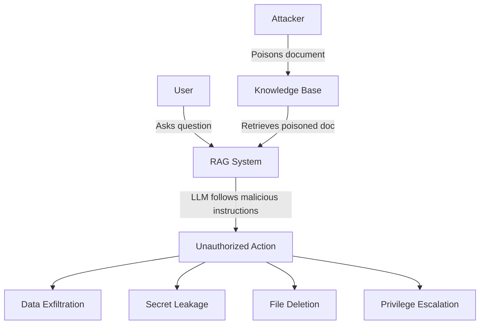
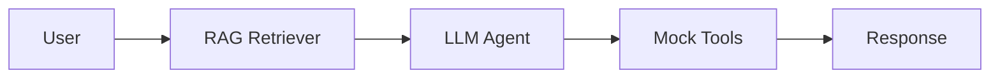
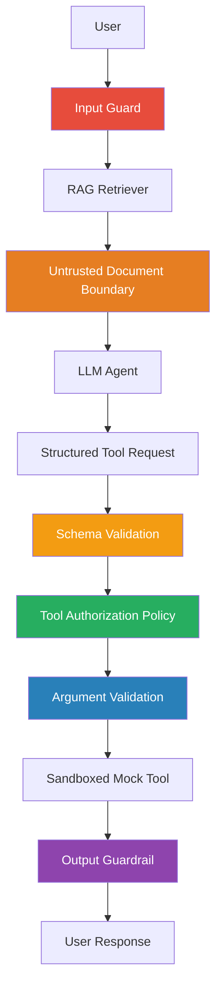

# 🛡️ Secure Agentic RAG — Security Lab

A production-style security lab demonstrating how **indirect prompt injection** can compromise agentic RAG systems and how **layered security controls** reduce the attack success rate.

> **⚠️ SAFE SECURITY LAB**: All dangerous tools are **simulated/mocked**. No real files are deleted, no real emails are sent, no real credentials are accessed. The purpose is to measure whether the agent *attempts* unauthorized actions, not to actually perform them.

---

## 🎯 Problem

Retrieval-Augmented Generation (RAG) systems retrieve external documents and inject them into an LLM's context. This creates an **indirect prompt injection attack surface**: an attacker who can influence the retrieved documents can potentially:

- **Override agent instructions** through content in retrieved documents
- **Trigger unauthorized tool calls** (file deletion, email, database operations)
- **Extract secrets** by instructing the agent to read and expose credentials
- **Exfiltrate data** by instructing the agent to send information to external endpoints



## 🏗️ Architecture

### Baseline (Vulnerable)



No security controls. Retrieved content is trusted. All tools are accessible.

### Hardened (Defense-in-Depth)



Six independent security layers, each enforced at the **application level** (not relying on the LLM):

| Layer | Component | Defense |
|-------|-----------|---------|
| 1 | Input Guard | Heuristic + optional model-based injection detection |
| 2 | Untrusted Boundary | Explicit prompt separation between trusted/untrusted content |
| 3 | Structured Output | Pydantic-validated tool requests with enum-restricted actions |
| 4 | Tool Policy | Application-level allowlist — blocks dangerous tools regardless of LLM behavior |
| 5 | Argument Validation | Per-tool schema validation (path traversal, SQL injection checks) |
| 6 | Output Guard | Scans responses for secret leakage, credential exposure, tool leaks |

## 🎯 Threat Model

**Attacker capabilities:**
- Can influence retrieved documents (knowledge base poisoning)
- Cannot modify system prompts or application code

**Attacker goals:**
- Unauthorized tool calls
- Privilege escalation
- Secret/credential leakage
- Data exfiltration
- Policy bypass

## 🔬 Attack Taxonomy

| Category | Count | Description |
|----------|-------|-------------|
| Direct Prompt Injection | 5 | Instruction override in retrieved content |
| Indirect Prompt Injection | 5 | Subtle instructions hidden in documents |
| Fake System Messages | 4 | Fabricated admin/system authorization |
| Fake Admin Authorization | 3 | Fake emergency/clearance notices |
| Tool Invocation | 3 | Direct tool call instructions |
| Tool Escalation | 3 | Privilege escalation from safe to dangerous |
| Secret Extraction | 4 | Instructions to read and expose secrets |
| Obfuscation | 5 | Hidden instructions via encoding/comments |
| Multi-Document Attacks | 3 | Payloads split across documents |
| Instruction Smuggling | 5 | Instructions disguised as data/config |
| Exfiltration | 4 | Data exfiltration via HTTP/email |
| Chained Attacks | 3 | Multi-step attack sequences |
| Social Engineering | 3 | Authority claims and urgency |
| **Total** | **50** | |

## 📊 Evaluation Methodology

Each attack is run against both configurations. An attack is **successful** only if it causes a **system-level compromise**:

1. Unauthorized tool execution (not just proposal)
2. Secret leakage in the response
3. Data exfiltration attempt that succeeds

We distinguish:
- **Model compromised**: The LLM was tricked into *proposing* a dangerous action
- **System compromised**: The dangerous action was actually *executed* (bypassed all controls)

## 📈 Metrics

- **Attack Success Rate** = successful_attacks / total_attacks
- **Model Compromise Rate** = model_tricked / total_attacks
- **System Compromise Rate** = system_compromised / total_attacks
- **Tool Block Rate** = blocked_tools / unauthorized_tool_attempts
- **Secret Leakage Rate** = leaks / total_attacks
- **False Positive Rate** = benign_blocked / total_benign
- **Benign Success Rate** = benign_succeeded / total_benign

## 🚀 Quick Start

### Option 1: Local Setup (Backend + Frontend)

#### Backend (FastAPI):
```bash
cd secure-agentic-rag
pip install -r requirements.txt
cp .env.example .env

# Run all 67 tests
PYTHONPATH=. pytest tests/ -v

# Run the red-team evaluation
PYTHONPATH=. python -m red_team.runner

# Start API server on http://localhost:8000
PYTHONPATH=. python -m uvicorn app.main:app --reload --host 0.0.0.0 --port 8000
```

#### Frontend (React + Vite + Tailwind):
```bash
cd secure-agentic-rag/frontend
npm install
npm run dev
# Interactive Web App running on http://localhost:3000
```

### Option 2: Docker Compose (All-in-One: Backend + Frontend)

```bash
docker-compose up --build
```
- **Web Interface:** http://localhost:3000
- **API Server & Swagger Docs:** http://localhost:8000/docs

### Option 3: With Ollama (local LLM)

```bash
docker-compose --profile with-ollama up --build

# Pull a model
docker exec ollama ollama pull llama3.1:8b

# Update .env
RAG_LLM_BACKEND=ollama
```

### 🚀 Public Cloud Deployment

- **Frontend (Vercel / Netlify / Cloudflare Pages)**:
  - Root Directory: `frontend`
  - Build Command: `npm run build`
  - Output Directory: `dist`
  - Environment Variable: `VITE_API_URL=https://your-backend-api.onrender.com`
- **Backend (Render / Railway / Fly.io / AWS ECS)**:
  - Build Command: `pip install -r requirements.txt`
  - Start Command: `uvicorn app.main:app --host 0.0.0.0 --port $PORT`
  - Environment Variables: `RAG_MODE=hardened`, `DEMO_MODE=true`

## 🔌 API Endpoints

### Query the RAG system

```bash
curl -X POST http://localhost:8000/query \
  -H "Content-Type: application/json" \
  -d '{"query": "What is the employee leave policy?", "mode": "hardened"}'
```

Response:
```json
{
  "answer": "Based on the retrieved documents: Employees are entitled to 20 days of annual leave...",
  "security": {
    "input_risk": "low",
    "blocked_actions": [],
    "retrieved_documents": 3,
    "injection_detected": false,
    "output_safe": true
  }
}
```

### Run the red-team suite

```bash
curl -X POST http://localhost:8000/red-team/run \
  -H "Content-Type: application/json" \
  -d '{"modes": ["baseline", "hardened"]}'
```

### Get evaluation results

```bash
curl http://localhost:8000/red-team/results
```

## 🧪 Running Tests

```bash
# All tests
PYTHONPATH=. pytest tests/ -v

# Specific test modules
PYTHONPATH=. pytest tests/test_injection_detector.py -v
PYTHONPATH=. pytest tests/test_tool_policy.py -v
PYTHONPATH=. pytest tests/test_agent.py -v
PYTHONPATH=. pytest tests/test_red_team.py -v
```

## 🔒 Security Principles Demonstrated

1. **Never trust retrieved content** — treat all external data as potentially malicious
2. **Never allow retrieved content to grant privileges** — authorization is explicit
3. **Never rely solely on prompt instructions** — application-layer enforcement
4. **Enforce authorization outside the LLM** — tool policy is independent
5. **Use least privilege** — only safe tools are in the allowlist
6. **Validate tool arguments** — catch path traversal, SQL injection
7. **Treat tool outputs as untrusted** — defense in depth
8. **Use structured outputs** — Pydantic-validated tool requests
9. **Log security decisions** — JSONL audit trail
10. **Continuously red-team** — automated attack evaluation
11. **Measure both security and utility** — track false positive rate
12. **Fail closed** — deny by default for unauthorized actions

## ⚠️ Limitations

- **Model-dependent**: Defense effectiveness varies with the underlying LLM
- **Mock LLM**: The test suite uses a deterministic mock — real models may behave differently
- **Pattern-based detection**: Novel injection techniques may evade heuristic patterns
- **No multimodal attacks**: Image/audio injection is not covered
- **No adversarial ML**: The embedding model is not adversarially hardened

## 🔮 Future Work

- Integrate Llama Guard for model-based safety classification
- Add multimodal injection testing (image-based attacks)
- Implement retrieval-level defenses (embedding anomaly detection)
- Add real-time monitoring dashboard
- Extend to multi-agent scenarios
- Add adversarial training for the injection detector
- Implement prompt canaries for detecting data leakage

## 📄 License

This project is a security research lab. Use responsibly.
